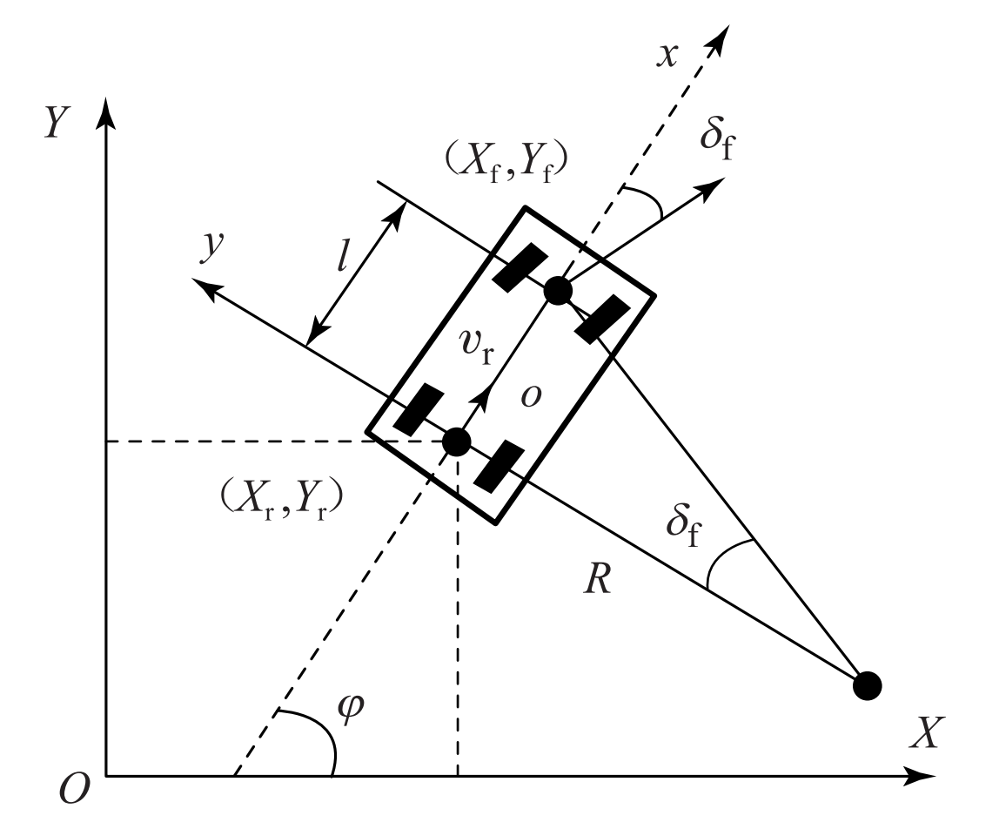

To describe the kinematics of a vehicle, two coordinate systems need to be established, the inertial coordinate system $XOY$ and the body coordinate system $xoy$, as shown in the figure. The yaw angle $\phi$ of the vehicle is defined as the angle between the x-axis of the body coordinate system and the x-axis of the inertial coordinate system, which is positive in the counterclockwise direction. $(X_{\mathrm{r}},Y_{\mathrm{r}})$ and $(X_{\mathrm{f}},Y_{\mathrm{f}})$ are the coordinates of the center of the rear axle and the center of the front axle of the vehicle in the inertial coordinate system, respectively. $v_\mathrm{r}$ is the speed of the vehicle at the center of the rear axle, $l$ is the wheelbase, $R$ is the instantaneous turning radius of the center of the rear axle, and $\delta_\mathrm{f}$ is the front wheel deflection angle, which is positive in the counterclockwise direction.

The equation can be established at the center of the vehicle's rear axle:
$$
v_\mathrm{~r~}=
\begin{array}
{c}\dot{X}_\mathrm{~r}\cos\varphi+\dot{Y}_\mathrm{~r}\sin\varphi
\end{array}
$$
In order to ensure that the vehicle does not deviate on the $y$ axis, the kinematic constraints at the center of the front and rear axles are
$$
\begin{cases}
\dot{X}_\mathrm{f}\sin(\varphi+\delta_\mathrm{f})-\dot{Y}_\mathrm{f}\cos(\varphi+\delta_\mathrm{f})=0 \\
\dot{X}_\mathrm{r}\sin\varphi-\dot{Y}_\mathrm{r}\cos\varphi=0 &
\end{cases}
$$
Combining equation (1) and equation (2), we can get

$$
\left\{\begin{array}{l}
\dot{X}_t=v_{\mathrm{r}} \cos \varphi \\
\dot{Y}_r=v_{\mathrm{t}} \sin \varphi
\end{array}\right.
$$

According to the geometric relationship between the front and rear wheels, we can get

$$
\left\{\begin{array}{l}
X_{\mathrm{f}}=X_r+l \cos \varphi \\
Y_{\mathrm{f}}=Y_{\mathrm{r}}+l \sin \varphi
\end{array}\right.
$$

Substituting equation (3) and equation (4) into equation (2), we can solve for the yaw rate

$$
\omega=\frac{v_r}{l} \tan \delta_{\mathrm{f}}
$$

Where $\omega$ is the vehicle's yaw rate; at the same time, the turning radius $R$ and the front wheel deflection angle $\delta_i$ can be obtained from $\omega$ and the vehicle speed $v$:

$$
\left\{\begin{array}{l}
R=v_{\mathrm{r}} / \omega \\
\delta_{\mathrm{f}}=\arctan (l / R)
\end{array}\right.
$$

From equations (3) and (5), the vehicle kinematic model can be obtained as

$$
\left[\begin{array}{c}
\dot{X}_r \\
\dot{Y}_r \\
\dot{\varphi}
\end{array}\right]=\left[\begin{array}{c}
\cos \varphi \\
\sin \varphi \\
\tan \delta_r / l
\end{array}\right] v_r
$$
In the process of vehicle path tracking, the control quantity we want is $\left[v_{\mathrm{r}}, \omega\right]$, so the vehicle kinematic model can be converted to
$$
\left[\begin{array}{c}
\dot{X}_r \\
\dot{Y}_r \\
\dot{\varphi}
\end{array}\right]=\left[\begin{array}{c}
\cos \varphi \\
\sin \varphi \\
0
\end{array}\right] v_{\mathrm{r}}+\left[\begin{array}{l}
0 \\
0 \\
1
\end{array}\right] \omega
$$